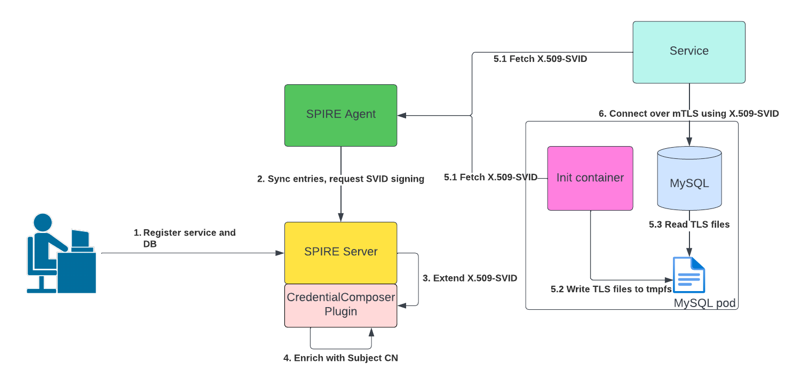

# MySQL mTLS Authentication using SPIRE

Demonstration of using SPIRE-issued X.509-SVIDs in MySQL database and clients, providing client authentication
and connection encryption in MySQL via mutual-TLS (mTLS), deployed on Kubernetes. This project assumes readers to have 
basic knowledge of the following technologies and concepts:

1. [SPIFFE](https://spiffe.io/) and [SPIRE](https://github.com/spiffe/spire)
1. [Kubernetes](https://kubernetes.io/)
1. [MySQL](https://www.mysql.com/)
1. [Transport Layer Security](https://en.wikipedia.org/wiki/Transport_Layer_Security)

## [Getting Started](#getting-started)

This section guides deploying and setting up components involved in this project on a Kubernetes cluster.
Refer [design](#design) for details on the components involved.

### Prerequisites

1. `kubectl` is installed and available on the PATH: https://kubernetes.io/docs/tasks/tools/ 
2. Kubernetes cluster is configured with `kubectl` and `kubectl context` is set to use this cluster
3. `curl` is installed and available on the PATH: https://curl.se/

### Deploy and Setup

Deploy SPIRE server and SPIRE agent in the `spire` namespace on the cluster.
The script also creates necessary registrations in SPIRE server.
```
./01-setup-spire.sh
```

Deploy MySQL server along with a persistent volume in the `mysql` namespace on the cluster
```
./02-deploy-mysql.sh
```

In a separate terminal, start port forwarding to MySQL server pod
```
kubectl -n mysql port-forward service/mysql 9999:3306
```

Setup MySQL users and database, by connecting to the MySQL server via port-forwarding.
```
./03-setup-mysql.sh
```

Deploy `sample-service` in the default namespace.
```
./04-deploy-service.sh
```

### Verify DB Access using Sample Service

This section verifies DB access via mTLS using Sample Service.

In a separate terminal, start port forwarding to the `sample-service` 
```
kubectl port-forward service/sample-service 8888:8888
```

Use `curl` to verify the `GET /api/v1/users` endpoint on `localhost:8888`. The output should contain sample user data which was created
during MySQL DB setup.
```
curl -s -X GET http://localhost:8888/api/v1/users
```

Use `curl` to create a new user 
```
curl -s -X POST http://localhost:8888/api/v1/users -H 'Content-Type: application/json' -d '{"Name":"David"}'
```

Verify the newly created user is showing up in the `GET /api/v1/users` request
```
curl -s -X GET http://localhost:8888/api/v1/users
```

Verify the DB connection made by `sample-service` in the MySQL server general log. It should have a `Connect` log message from 
`spire-mysql-client` user (representing sample-service) connecting to the `spiredemo` DB using SSL/TLS.
```
kubectl -n mysql exec -it mysql-0 -c mysql -- cat /var/lib/mysql/general.log
```

### Cleanup 

Cleanup the environment using the cleanup script
```
./cleanup.sh
```

## [Design](#design)

### Architecture



MySQL server uses its X.509-SVID as TLS server certificate, and clients use the X.509-SVIDs as client certificates 
to authenticate to the MySQL server. SPIRE Server and SPIRE Agent are deployed on the Kubernetes Cluster along
with registration entries created in the SPIRE Server. MySQL is deployed with an init-container that fetches an
X.509-SVID from SPIRE agent and writes to a tmpfs volume shared with the MySQL server container.
Upon init, the MySQL server container reads the X.509-SVID from the tmpfs volume for SSL configuration.

The sample-service also fetches its X.509-SVID from SPIRE and uses it to authenticate to MySQL server over mTLS. 
It uses the trust bundle distributed by SPIRE Agent to verify MySQL server's certificate during the TLS handshake.

The design also uses SPIRE CredentialComposer plugin to enrich X.509-SVIDs issued to the sample-service 
with a `Subject` with a unique Common Name - `/C=US/O=SPIRE/CN=spire-mysql-client`,
thereby mapping this service's identity to the user created in MySQL -
`CREATE USER 'spire-mysql-client' REQUIRE SUBJECT '/C=US/O=SPIRE/CN=spire-mysql-client'`.
This is needed because MySQL doesn't understand the default SPIFFE authentication semantics of verifying 
the SPIFFE ID in the `URI SAN` in X.509-SVIDs. Hence, customizing a unique `Subject` per workload enables MySQL
to authenticate callers based on the X.509 `Subject` field.

### Certificate Auto-Rotation


For security reasons, SPIRE server is configured to issue X.509-SVIDs with a relatively low TTL. This poses a 
challenge with MySQL server certificate rotation as the server TLS configuration frequently needs to be updated to 
use the newest X.509-SVID content from SPIRE agent. To achieve auto-rotation, MySQL server pod has a custom sidecar container called 
TLS reloader, which is responsible for rotating the MySQL server's TLS configuration. It does so by fetching 
X.509-SVID updates from SPIRE agent, writing them to the pod's tmpfs volume and executing the `ALTER INSTANCE RELOAD TLS` 
query on the MySQL server. This query forces the MySQL server to reload its TLS configuration from disk.

